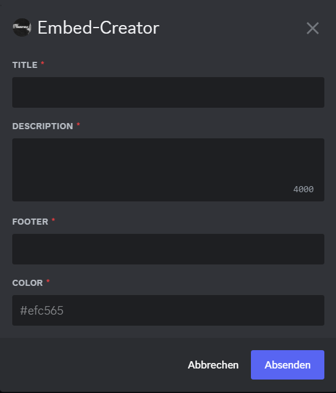
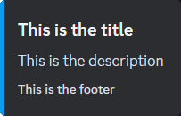

# Embed-Creator [ v1.0.0 ]

## Developer Portal
A Discord token is required for execution.

### Permissions
The following permissions must be given to the bot.
* Privileged Gateway Intents
  * Presence Intent
  * Message Content Intent
* Bot Permissions
  * General Permissions
    * Administrator

## Run Bot
### 1. Install `requirements.txt`
```
pip install -r .\requirements.txt
```

### 2. Run the bot
```
python main.py
```

## Use Bot
### Command:
* /embed

## Images
### Input Form:


### Embed:
